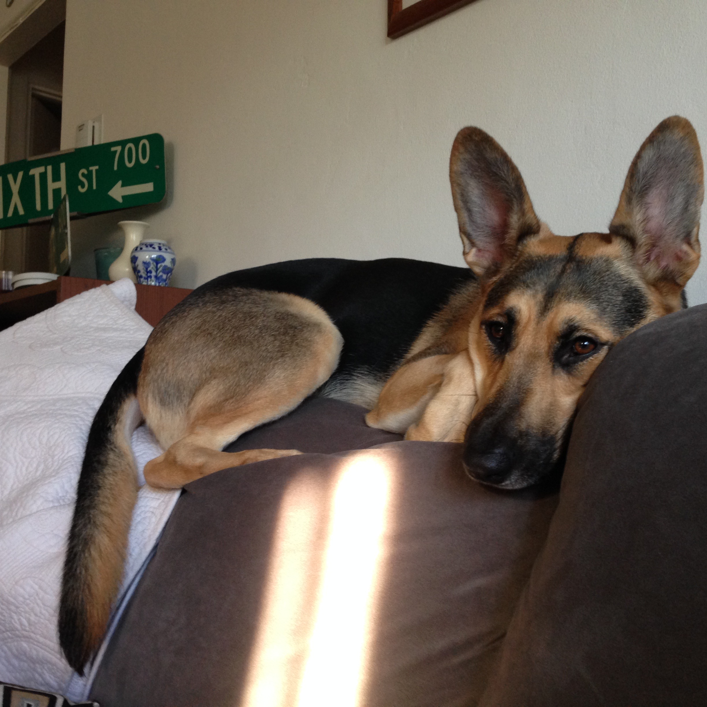
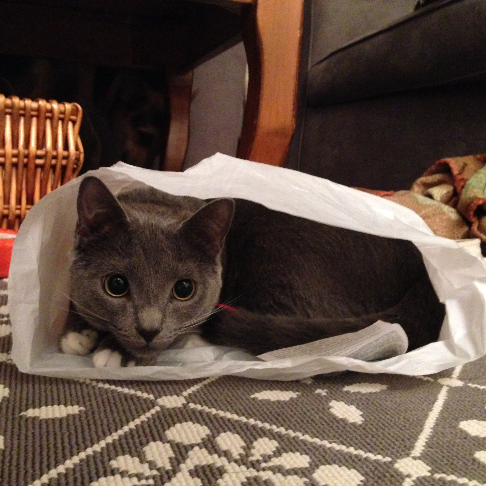

About Me
===========

I am currently a first year applied math PhD student. I am currently in the process of figuring out a research project. However, I am interested in numerical PDEs and numerical linear algebra with applications in computation fluid dynamics. I obtained my BS in Mechanical Engineering from UC Davis and my MS in Applied Math from San Diego State University. 

Outside of school I enjoy biking. Sometime ago I only did road biking but more recently I have been mountain biking. Since moving to Santa Cruz, I have spent a lot less time on the skinnies. I also have a pretty cool dog named Luna who I play fetch with and a sassy cat named Willa who I pick up against her will. My favorite candies are Haribo gummy bears.

   
